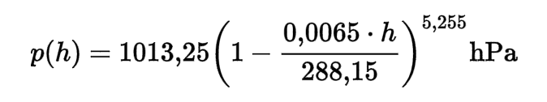

# Simulate Weather with Python

<div>
  <div align="center">
    
  </div>
  <div align="center">
    <a href="https://travis-ci.org/AntonyBrd/weather-simulation">
      
    </a>
  </div>
<div>

This small project introduce a way to generate fake weather data with a very small code base. 
The weather data is generated for the following cities:
- Sydney
- Darwin
- Paris
- Toulouse
- ...

## How to use the application

### Pre requirements
- Python 2.7
- install pip
- run the following command
```bash
pip install -r requirement.txt
```

Generating data files is as simple as running the command :
```
python main.py
```

Be careful, the application generates a file that you may have to delete
if you want to re-run it. 

Once `pytest` is installed, you can run unit tests with:
```
pytest
```

## The approach

### Step 1: Defining different climate types

To be accurate on climate, we are going to use the
[Koppen climate classification](https://en.wikipedia.org/wiki/K%C3%B6ppen_climate_classification),
which is largely used and accepted. This classification has different level of
precision, to keep it simple let just use the following groups:
- **A** Tropical 
- **B** Arid
- **C** Temperate
- **D** Cold
- **E** Polar

 <div align="center">
    
  </div>

Each group will have a specific mean temperature. We should go further in using the second and the third 
letter of this classification to get more accurate simulations.
 
### Step 2: Create a list of city and get their climate

2.a Create a json file with city name and country

2.b Attribute a climate to each city <br>
_NB: We could make this step automatic by crawling into the Wikipedia page of the concerned City. 
There is a [Wikipedia Python package](https://pypi.python.org/pypi/wikipedia) that could help to do so._ 

2.c Set manually the city elevation in json data <br>
_NB: This step should also be automatic if my first API choice have been smarter_

### Step 3: Use an API to get City position

I choose to use the [OpenWeatherMap API](https://openweathermap.org/current), which turned out not to be a great idea. 
Indeed, I do not use provided weather information but only the coordinate and O do not get
the city elevation data.

### Step 4: Simulate data

First of all, we simulate the date, randomly following the uniform law.

Once the date is available, we simulate the pressure because we have an accurate idea of what this could be thanks
to the [formula of barometric leveling](https://en.wikipedia.org/wiki/Barometric_formula).

 <div align="center">
    
  </div>

We introduce noise to this estimation to get different value at each run.

Now, we know that if the pressure value is lower than usual it is more likely to rain, or to have
a low temperature. Depending on season and pressure, we can simulate the temperature using a very basic
algorithm, which works like a decision tree.

Following this process, we simulate the condition and finally the humidity,
each step having access to more information than the previous one.

 
### Step 5: Write the results to a file

Very simple step, using basic Python.

## Code description

Dealing with weather simulation, we need to defined a set of concepts:

- a city is defined by the following attributes: name, country, coordinate (lat/lon), elevation.
- the weather in a city makes sense only at a specific moment. Here is the attribute list for weather: city, date,
conditions, pressure, temperature, and humidity.

Each concept has its own class, its own file, and its own objective.

#### city.py

The city file is responsible for the web service call, to get city coordinates.

#### weather.py

The weather file handles the simulation, all the random aspect of the application and all the business
rules.

#### main.py

This script launches the application by reading json input data from the data directory.
For each city being in the input file, it simulates the weather and write the result into a file. The
process is done 10 times increase the outfile file size.

## How to improve this application

There are many ways to improve this project, let's try to make it smarter.

### Solve TODOs

The way the elevation is handled is quite bad. [Here](https://visibleearth.nasa.gov/view.php?id=73934),
you can find an image of the world map with elevation for red values.

### Use better "business" rules (here: physical models)

First of all, we would need to use time zone to get day/night information. This will widely 
improve temperature accuracy.

There are many climate models that provide great estimation of the weather.
Working with people that have a good understanding of these model would definitely improve the
application.

### Use Machine Learning 

#### Supervised learning to predict values

The same way we have computed each feature one by one, the next depending on
the previous one. We could have train different algorithms to predict those values.

#### Neural nets to invent data

There are Neural Network specialised in data generation that it would be great to test.
For example, RNN are able to write theatre piece that have a very good structure, with a lot of input data we could 
generate data for cities that does not even exist. 

Here is a very nice example of how to build a RNN with Tensorflow :
https://github.com/martin-gorner/tensorflow-rnn-shakespeare

### Plot this data on a world map

The current output is a flat file, which is not really funny to read. Python package like `bokeh` and
many others will help to create nice visualisation.


